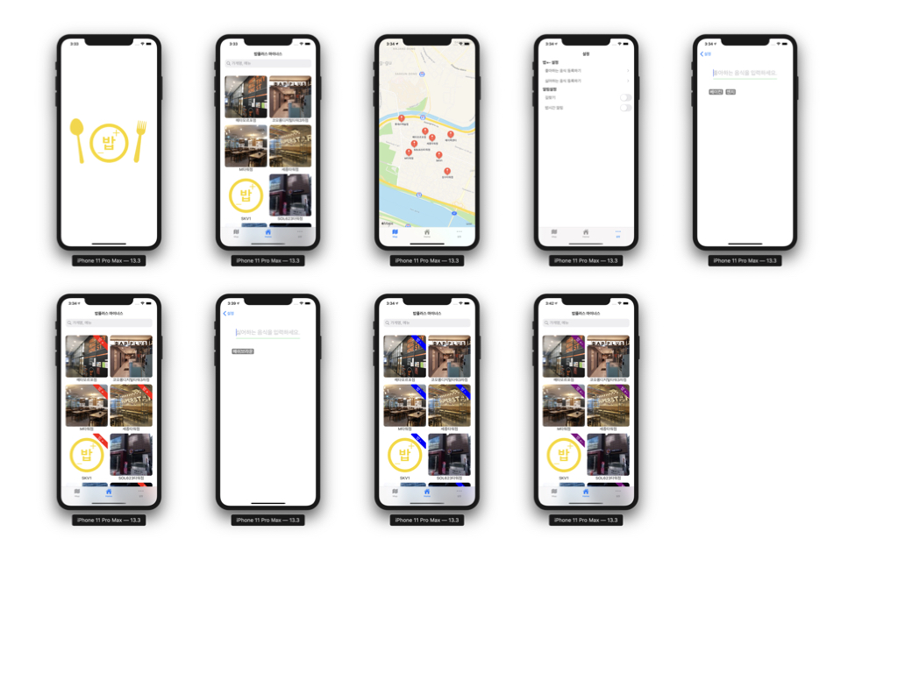
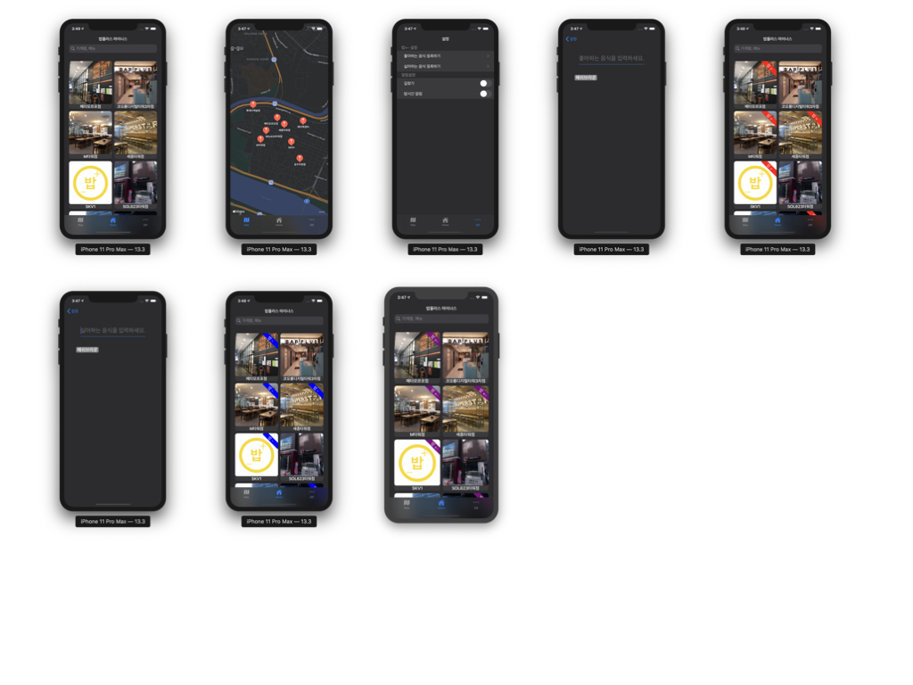

# 밥플러스 마이너스

> 패스트캠퍼스 iOS School에서 진행한 해커톤 프로젝트

> 해커톤 이후 기능 추가

## 설명

성수 근처 식판 밥집인 밥플러스의 메뉴를 보고 싶어서 개발한 앱

- 기간: 2020.02.13 ~ 2020.03.13
- 사용 기술:
  - 언어: Swift, Python
  - 프레임워크: UIKit, MapKit, CoreLocation
- 인원: 2명
- 기여도: 60%
- 역할:
  - 데이터 구조 설계 및 스크래핑
  - 선택한 지점의 상세 메뉴 페이지 작성
  - 해커톤 이후 다크모드 적용, 설정페이지, 좋아/싫어 하는 메뉴 등록
  - Toast Message 구현
- 성과:
  - 현재도 사용하고 있으며, 학원을 다니면서 받았던 피드백들을 참고하여 기능 개선 후 출시 예정 중이다.
  - 터치 이벤트를 제어하기 위해 HitTest override
  - 다크모드 지원

## 결과

 
 